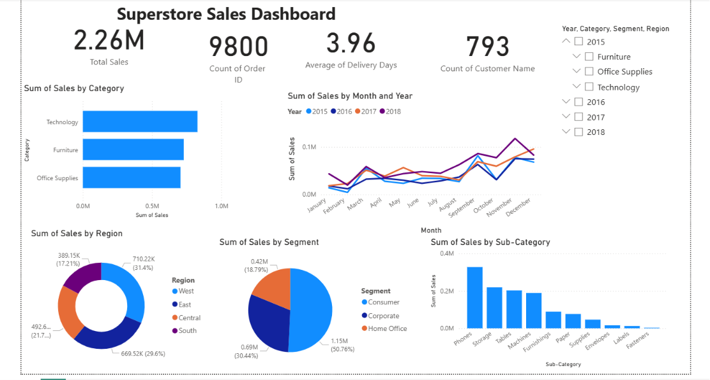

# 🛒 Superstore Sales Analysis Dashboard

## 📌 Project Overview
This project analyzes sales data from a retail superstore to uncover key business insights related to revenue, regional performance, customer segments, product categories, and shipping efficiency. The goal is to help the business make data-driven decisions to improve sales and operational performance.

An interactive **Power BI dashboard** was built to visualize trends and KPIs at a glance.

---

## 🎯 Objective
- Identify top-performing product categories and sub-categories
- Analyze regional and state-wise sales performance
- Understand customer segment contribution to revenue
- Evaluate shipping mode efficiency and delivery times
- Identify seasonal sales trends for better inventory and marketing planning

---

## 📂 Dataset
- **Source:** Superstore Sales Dataset (Kaggle)
- **Records:** 9,800 rows
- **Columns:** 19 (Order details, Customer info, Product info, Sales, Delivery Days, etc.)

**Key columns used:**
`Order Date`, `Ship Date`, `Ship Mode`, `Segment`, `Region`, `State`, `Category`, `Sub-Category`, `Product Name`, `Sales`, `Delivery Days`

---

## 🛠️ Tools & Technologies
- **Python** (Pandas) – Data cleaning and preprocessing
- **Power BI** – Dashboard creation and visualization
- **Excel/CSV** – Data storage

---

## 🧹 Data Cleaning Steps
1. Converted `Order Date` and `Ship Date` to proper date format
2. Created a new `Delivery Days` column (Ship Date − Order Date)
3. Handled missing values in `Postal Code`
4. Removed duplicate records
5. Extracted `Month`, `Year`, and `Quarter` for time-based analysis

---

## 📊 Dashboard Features
The Power BI dashboard includes:
- **KPI Cards:** Total Sales, Total Orders, Avg Delivery Days, Total Customers
- **Bar Chart:** Sales by Category
- **Line Chart:** Monthly Sales Trend
- **Donut Chart:** Sales by Region
- **Pie Chart:** Sales by Customer Segment
- **Bar Chart:** Top 10 Sub-Categories by Sales
- **Slicers:** Year, Region, Category, Segment (for interactive filtering)

---

## 🔑 Key Insights

| Insight | Finding |
|---|---|
| **Top Category** | Technology generates the highest revenue (₹827K) |
| **Top Region** | West region leads with ₹710K in sales |
| **Best Segment** | Consumer segment contributes ₹1.15M — more than Corporate & Home Office combined |
| **Top Sub-Categories** | Phones and Chairs are the best-selling products |
| **Top States** | California and New York are the strongest markets |
| **Shipping** | Standard Class is used by 60% of customers but has the slowest avg delivery (~5 days) |
| **Seasonality** | November and December are peak sales months (holiday season effect) |

---

## 💡 Business Recommendations
- Focus marketing budget on the **Consumer segment** and **West/East regions**, where ROI is highest
- Investigate underperformance in the **South region** with localized promotions
- Promote faster shipping options, as **Standard Class's** longer delivery time may be affecting customer satisfaction
- Plan inventory and marketing campaigns around the **November–December** peak season

---

## 📁 Project Files
```
├── superstore_cleaned.csv     # Cleaned dataset used for analysis
├── Superstore_Dashboard.pbix  # Power BI dashboard file
├── dashboard_screenshot.png   # Dashboard preview image
└── README.md                  # Project documentation
```

---

## 📸 Dashboard Preview
*(Add a screenshot of your Power BI dashboard here)*

```

```

---

## 🚀 How to Use
1. Clone this repository
2. Open `Superstore_Dashboard.pbix` in Power BI Desktop
3. Explore the dashboard using the slicers to filter by Year, Region, Category, or Segment

---

## 👤 Author
**[Your Name]**
Data Analytics Enthusiast | [LinkedIn] | [GitHub] | [Email]

---

## 📜 License
This project is for educational purposes as part of a data analytics portfolio.
